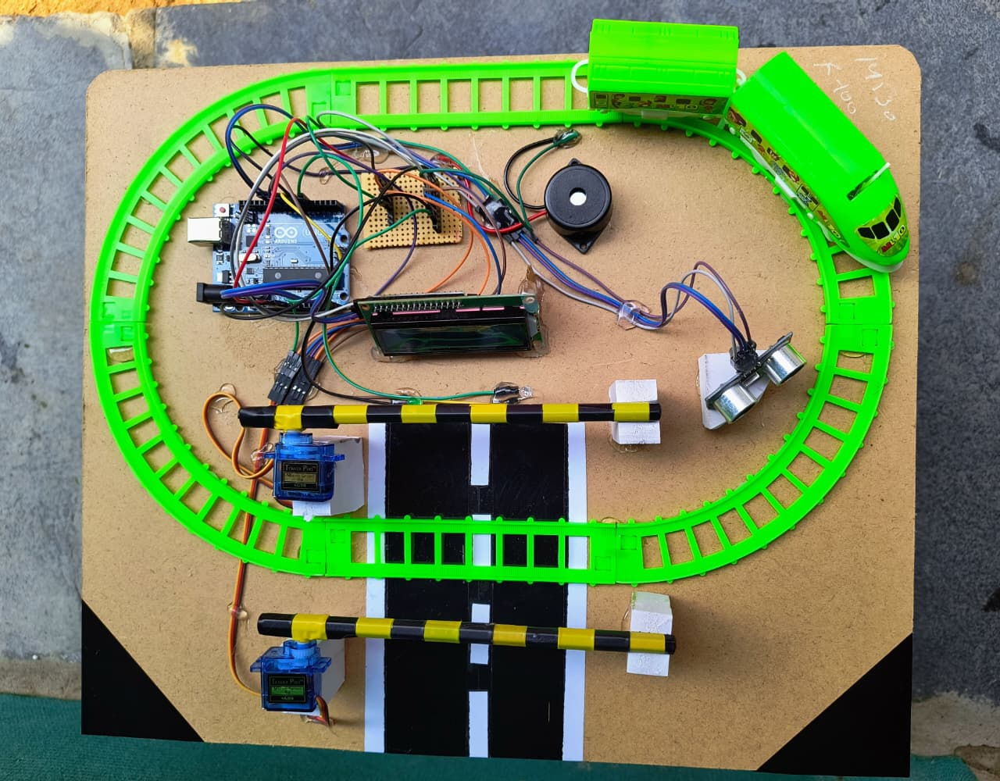

# 🚦 Automatic Railway Gate Control System (Dual Gate)

**Automatic Railway Gate Control System** is an Arduino-based embedded automation project designed to enhance railway crossing safety by automatically controlling dual gates using ultrasonic sensors and servo motors.  
This system detects the train's movement and automatically closes the gates as it approaches, then reopens them after it passes — preventing accidents at unmanned crossings.

---

## 📘 Project Overview

Accidents at railway crossings are one of the major causes of fatalities, particularly in rural or unmanned regions.  
This project automates gate operation using **Arduino Uno** and **ultrasonic sensors**, which sense the train’s presence and movement direction.

When a train approaches the crossing, the **first ultrasonic sensor** detects it, triggering the gate-closing sequence with **servo motors** and **buzzer alerts**.  
Once the train passes and the **second sensor** confirms its departure, the system automatically opens the gates, restoring normal road traffic.

---

## 🧠 Key Features

- 🚧 **Dual Gate Automation** – Both gates open and close automatically in sync.  
- 🚦 **Train Detection System** – Uses ultrasonic sensors for precise train approach and departure sensing.  
- 🔔 **Buzzer Alerts** – Sound warnings before the gate closes to alert vehicles and pedestrians.  
- 💡 **LED Indicators** – Red and Green LEDs signal “Train Coming” or “Safe to Cross.”  
- ⚙️ **Servo Motors** – Control both gates smoothly and accurately.  
- 🔁 **Fully Automatic Operation** – No manual involvement required.  
- 🧱 **Compact & Cost-Effective Design** – Simple yet powerful for prototype or real-world use.

---

## ⚙️ System Architecture

**Modules Used:**
- **Arduino Uno (ATmega328P)** – Central controller for sensor logic and actuation.  
- **Ultrasonic Sensors (2x HC-SR04)** – Detect train presence at entry and exit points.  
- **Servo Motors (2x)** – Operate the left and right gates.  
- **Buzzer** – Provides warning alerts before and during gate operation.  
- **LED Indicators (Red & Green)** – Represent track status.  
- **Power Supply (5V/9V)** – Feeds the microcontroller and actuators.

**Operation Flow:**
1. **Sensor 1** detects the approaching train → Gate-closing sequence starts.  
2. Red LED and buzzer activate → Servo motors close both gates.  
3. When **Sensor 2** detects the train departure → Gates open.  
4. Green LED turns ON → Road traffic resumes safely.

---

## 💻 Technologies Used

| Component | Function |
|------------|-----------|
| **Arduino UNO** | Main controller for automation logic |
| **Ultrasonic Sensor (HC-SR04)** | Detects train arrival and departure |
| **Servo Motors (2x)** | Controls left and right gates |
| **LEDs (Red, Green)** | Indicate gate/track status |
| **Buzzer** | Alerts during gate operation |
| **Breadboard & Wires** | Circuit interfacing |
| **Power Supply (5V)** | Power to Arduino and servos |

---

## 🧩 Working Principle

1. **Sensor 1 (Entry Sensor)** detects an approaching train.  
2. Arduino activates **buzzer + red LED** and closes both gates using servo motors.  
3. After the train passes **Sensor 2 (Exit Sensor)**, the **green LED** turns ON.  
4. Servo motors reopen the gates automatically, allowing road traffic to resume.  
5. System resets for the next detection cycle.

---

## 🧰 Hardware Connections (Quick Reference)

| **Arduino Pin** | **Connected Component / Function** |
|-----------------|------------------------------------|
| D2 | Ultrasonic Sensor 1 – Trigger |
| D3 | Ultrasonic Sensor 1 – Echo |
| D4 | Ultrasonic Sensor 2 – Trigger |
| D5 | Ultrasonic Sensor 2 – Echo |
| D6 | Servo Motor 1 (Gate 1) |
| D7 | Servo Motor 2 (Gate 2) |
| D8 | Red LED |
| D9 | Green LED |
| D10 | Buzzer |
| 5V / GND | Common Power & Ground Connections |

---

## 🔌 Power Requirements

| Component | Voltage | Current |
|------------|----------|---------|
| Arduino UNO | 5V | 50 mA |
| Ultrasonic Sensor | 5V | 15 mA each |
| Servo Motor | 5V | 200–500 mA each |
| Buzzer | 5V | 10 mA |
| LEDs | 5V | 5 mA each |

---

## 💾 Code Overview

The Arduino code includes:

- **Ultrasonic Detection Logic** for entry and exit sensors.  
- **Servo Control Functions** for dual gate movement.  
- **Buzzer & LED Alert System** synchronized with train detection.  
- **Timed Delay Management** to ensure complete gate closure before train arrival.  

---

## 📊 Results & Observations

- ✅ Reliable train detection with ultrasonic sensors.  
- ⚡ Fast servo response for gate movement.  
- 🔔 Clear audio and visual alerts for safety.  
- 🚧 Smooth dual gate synchronization.  
- 🧠 Consistent reset cycle for next operation.

---

## 🌍 Advantages

- Prevents accidents at unmanned crossings  
- Operates autonomously without human control  
- Uses affordable, easily available components  
- Low power consumption  
- High reliability and safety improvement  

---

## ⚠️ Limitations

- Limited detection range (~100 cm for prototype setup)  
- May require weatherproofing for outdoor use  
- Sensitive to extreme vibration or noise interference  

---

## 🚀 Future Enhancements

- ☁️ IoT-based train tracking with GPS modules  
- 🧠 AI-based motion prediction for adaptive timing  
- ☀️ Solar-powered version for rural areas  
- 📡 GSM alert system for remote station monitoring  
- 🎥 Camera integration for visual confirmation  

---

## 👨‍🔧 Developed by  

**👨‍🔧 Merugumala Rabbuni**  
🎓 B.Tech in Electrical & Electronics Engineering (EEE)  
🔗 [GitHub](https://github.com/rabbunimerugumala)  
💼 [LinkedIn](https://www.linkedin.com/in/merugumala-rabbuni)

---

## 🪴 License

This project is released under the **MIT License** — free to use, modify, and distribute with proper attribution.

---

### ⭐ If you found this project helpful, consider giving it a star on GitHub!
